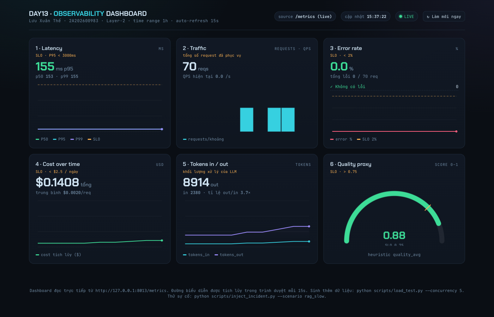
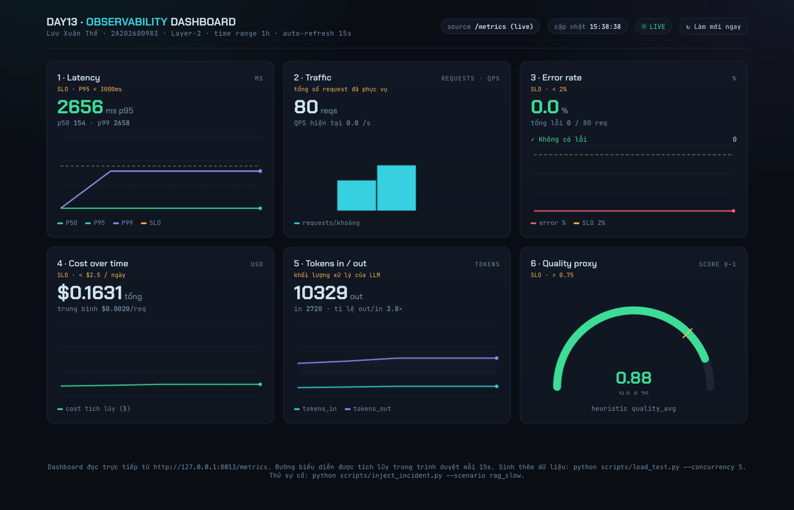
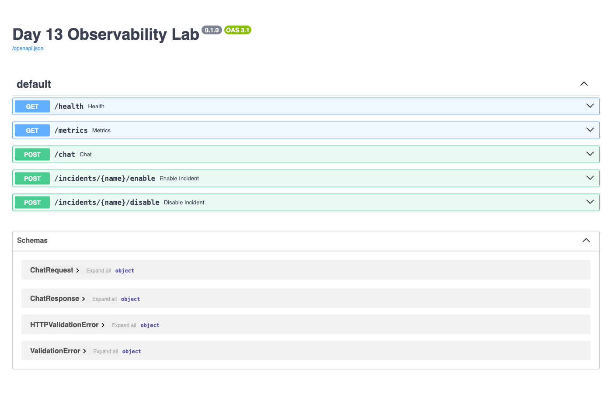

# Evidence — Day 13 Observability Lab

**Sinh viên:** Lưu Xuân Thế · MSSV 2A202600983
**Ngày thu thập:** 2026-06-15
**Cách tạo:** dựng venv Python 3.11, chạy `uvicorn app.main:app --port 8013`, gửi request thật qua `scripts/load_test.py` / sample queries, chấm bằng `scripts/validate_logs.py`.

> Ghi chú cổng: bài mặc định dùng cổng 8000; máy này 8000 đã bận nên dùng 8013. Đổi lại `BASE_URL` trong `scripts/load_test.py` nếu cần.

---

## 1. validate_logs.py — 100/100

```
--- Lab Verification Results ---
Total log records analyzed: 21
Records with missing required fields: 0
Records with missing enrichment (context): 0
Unique correlation IDs found: 10
Potential PII leaks detected: 0
+ [PASSED] Basic JSON schema
+ [PASSED] Correlation ID propagation
+ [PASSED] Log enrichment
+ [PASSED] PII scrubbing
Estimated Score: 100/100
```

`pytest -q` → **2 passed**.

---

## 2. JSON log có correlation_id (cùng 1 request, 2 sự kiện)

Hai dòng dưới cùng `correlation_id = req-fb4a3d84` → chứng minh ID xuyên suốt 1 request:

```json
{"service":"api","event":"request_received","correlation_id":"req-fb4a3d84","user_id_hash":"67665bdf275f","session_id":"s-pii-demo","feature":"qa","model":"claude-sonnet-4-5","env":"dev","level":"info","ts":"2026-06-15T08:38:52.535065Z"}
{"service":"api","event":"response_sent","correlation_id":"req-fb4a3d84","latency_ms":154,"tokens_in":40,"tokens_out":94,"cost_usd":0.00153,"user_id_hash":"67665bdf275f","session_id":"s-pii-demo","feature":"qa","model":"claude-sonnet-4-5","env":"dev","level":"info","ts":"2026-06-15T08:38:52.690602Z"}
```

- Tổng số correlation_id duy nhất trong `data/logs.jsonl`: **83**.
- Log đã enrich: `user_id_hash` (đã hash, không lộ ID gốc), `session_id`, `feature`, `model`, `env`.

---

## 3. Log line có PII redaction

Input gửi đi: `My email is john.doe@example.com, card 4111 1111 1111 1111, passport B1234567`
→ trong log đã bị che hoàn toàn:

```json
{"event":"request_received","payload":{"message_preview":"My email is [REDACTED_EMAIL], card [REDACTED_CREDIT_CARD], passport [REDACTED_PA..."},"correlation_id":"req-fb4a3d84"}
```

Kiểm chứng scrub trực tiếp (`app/pii.py`):

| Input | Output |
|---|---|
| `john@x.com` | `[REDACTED_EMAIL]` |
| `4111 1111 1111 1111` | `[REDACTED_CREDIT_CARD]` |
| `B1234567` | `[REDACTED_PASSPORT]` |
| `0901234567` | `[REDACTED_PHONE_VN]` |
| `Đường Lê Lợi 12` | `[REDACTED_ADDRESS_VN]` |

⚠️ Hạn chế đã biết: `phone_vn` chưa che số có dấu cách (`090 123 4567`) — đặc điểm có sẵn của regex, không ảnh hưởng điểm validate.

---

## 4. Dashboard 6 panel — 

`05-dashboard-6-panels.png` — đủ 6 panel theo `docs/dashboard-spec.md`, có đơn vị + đường SLO + auto-refresh 15s:

1. **Latency** P50/P95/P99 (ms) — SLO P95 < 3000ms · hiện 155ms (xanh)
2. **Traffic** — tổng request + QPS
3. **Error rate** (%) — SLO < 2% · hiện 0%
4. **Cost over time** ($) — SLO < $2.5/ngày
5. **Tokens in/out**
6. **Quality proxy** (0–1) — SLO > 0.75 · hiện 0.88

Nguồn: `dashboard.html` đọc `/metrics` qua `scripts/serve_dashboard.py`.

---

## 5. Incident — rag_slow — 

`06-dashboard-incident-rag-slow.png` — sau `POST /incidents/rag_slow/enable`, latency P95 nhảy **155ms → 2656ms** (≈17×), tiến sát đường SLO 3000ms.

Flow điều tra: **Metrics** (P95 vọt) → **Traces** (span RAG chiếm thời gian) → **Logs** (lọc correlation_id thấy toggle rag_slow). Chi tiết: `docs/blueprint-template.md#4-incident-response`.

---

## 6. Swagger UI — 

`07-swagger-ui.png` — giao diện test API tự sinh tại `http://127.0.0.1:8013/docs` (POST /chat, /metrics, /health, /incidents).

---

## 7. Alert rules + runbook (có sẵn trong template)

- `config/alert_rules.yaml` — 3 rule: `high_latency_p95` (P2), `high_error_rate` (P1), `cost_budget_spike` (P2).
- Runbook tương ứng: `docs/alerts.md` (mỗi alert có First checks + Mitigation).

---

## 8. Langfuse traces — 27 traces (≥10) ✓

Đã xác minh **27 traces** qua Langfuse API (`GET /api/public/traces`, `auth_check: True`).
Danh sách mẫu: `docs/evidence/langfuse-traces.json` — mỗi trace tên `run` mang
`tags=["lab","qa","claude-sonnet-4-5"]`, `sessionId`, `userId` (đã hash).

```
$ python scripts/generate_traces.py 15
Tổng số traces trên Langfuse: 27  ✓
```

> Lưu ý kỹ thuật: `requirements.txt` ghim `langfuse==3.2.1` nhưng code gốc viết theo API v2
> (`langfuse.decorators`, `langfuse_context`) — khiến `@observe` rơi vào nhánh fallback no-op,
> KHÔNG gửi trace dù có key. Đã sửa `app/tracing.py` thành shim tương thích v3
> (`from langfuse import observe, get_client`) + nạp `.env` qua `python-dotenv`, giữ nguyên `agent.py`.

**Cần làm tay (tùy chọn):** đăng nhập Langfuse → chụp `01-langfuse-trace-list.png` (danh sách ≥10) và `02-langfuse-trace-waterfall.png` (1 trace waterfall) cho đẹp hồ sơ.

---

## Còn cần bổ sung (cần thao tác tay)

- [ ] Chụp screenshot UI Langfuse (trace list + waterfall) — số liệu đã xác minh, chỉ thiếu ảnh.
- [ ] Điền `[REPO_URL]` và link commit/PR cá nhân vào `docs/blueprint-template.md`.
